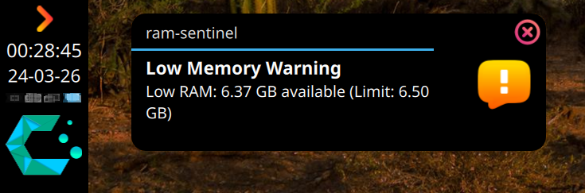
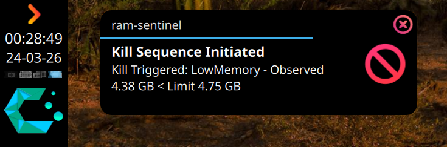
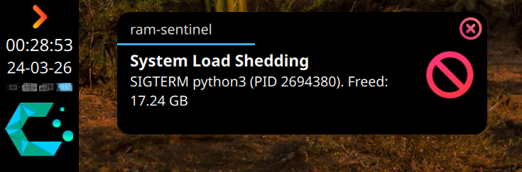

# RAM Sentinel 🛡️

**The Surgical Memory Guardian for Linux Desktops.**

Your Linux froze because **you opened too many tabs**?

RAM Sentinel prevents that by killing only the **offending processes** *(like Chrome renderer tabs)* before your system locks up.

> *Stop nuking my entire browser when I'm opening too many tabs!*

No more:
- losing your entire browser session
- 30-second freezes before OOM kicks in
- random process deaths you didn’t anticipate

[](https://github.com/benedictjohannes/ram-sentinel/actions)
[](https://crates.io/crates/ram-sentinel)
[](https://opensource.org/licenses/MIT)  

**ram-sentinel** runs as a normal user (no root required) and keeps you informed via desktop notifications.

Unlike tools like `earlyoom` or `nohang`, it doesn’t kill your biggest app.  
It uses **Surgical Process Targeting** to remove only low-value processes (like individual browser tabs).

So when memory runs low:
- You get a warning before things go bad
- The *right* processes get killed first
- Your main apps stay alive

<details>
<summary>And it's cheap to run, too.</summary>
2026-04-02T16:15:54+07:00 benedictbench01 systemd[7099]: ram-sentinel.service: Consumed 14.525s CPU time over 1d 17h 6min 5.199s wall clock time, 6.9M memory peak, 612K memory swap peak.
</details>

## 🚀 What happens under memory pressure?

Without RAM Sentinel:
- System starts stuttering
- Everything freeze for ~30 seconds
- The OOM killer nukes your entire browser
- You lose all tabs and unsaved work

With RAM Sentinel:
- You get an early warning
- Only the **expendables** (e.g. individual Chrome tabs) are removed
- Your browser stays alive
- Your system stays responsive

<details>
<summary>See how it handles a real memory crisis</summary>
When your system runs low on memory, `ram-sentinel` manages the crisis in tiers:

**Step 1: The Warning**



*You get an early warning that your system is under pressure, but still responsive.*

**Step 2: The Kill**



*It starts removing pressure: killing processes marked as expendable (like heavy tabs).*

**Step 3: Peace Restored**



*Pressure relieved. Your system stays smooth: no freeze, no mass process death, no surprises.*

> 👉 This is the difference between: reacting **after** your system is already unresponsive vs acting **before** things go bad.

</details>

| Feature         | Standard OOM Killer                                          | RAM Sentinel                                                                                                    |
| :-------------- | :----------------------------------------------------------- | :-------------------------------------------------------------------------------------------------------------- |
| **Targeting**   | Kills the parent process (Largest RSS). **Bye bye Browser.** | Targeted snipe. Kills `type=renderer` tabs first, or targets by **Cgroup v2** path. **Keeps Browser alive.**    |
| **Trigger**     | RAM Full (Too late) or blunt heuristic.                      | **PSI (Pressure)**: Detect when system *start stuttering*, before it freeze. Also monitors RAM/swap/zram usage. |
| **Safety**      | Can kill PID that was just reused (Race condition).          | **PID Identity Check**: Verifies process start time before killing.                                             |
| **UX**          | Silent death.                                                | **Notifications**: Warns you *before* killing. Tells you *what* it killed.                                      |
| **Permissions** | Root required.                                               | **Userspace**: Runs as YOU.                                                                                     |

## ⚡ Quick Start

You don't have to configure anything to get started. `ram-sentinel` ships with **[Sane Defaults](#sane-defaults-🛡️)** that work for most desktop users.

### Installation

#### Using Cargo

```bash
cargo install ram-sentinel
```

#### Binary download

```bash
curl -L https://github.com/benedictjohannes/ram-sentinel/releases/latest/download/ram-sentinel-linux-amd64 -o ram-sentinel && \
chmod +x ram-sentinel && \
sudo mv ram-sentinel /usr/local/bin/
```


### Run immediately

```bash
ram-sentinel
```

### Enable as a Service (Recommended)

Generate a systemd unit and enable it:

```bash
# Preview the unit file 
ram-sentinel --print-systemd-user-unit

# Install and Enable
mkdir -p ~/.config/systemd/user/
ram-sentinel --print-systemd-user-unit ~/.config/systemd/user/ram-sentinel.service
# edit if necessary
systemctl --user daemon-reload
systemctl --user enable --now ram-sentinel
```

## ⚙️ Configuration

`ram-sentinel` looks for a config file in `$XDG_CONFIG_HOME/ram-sentinel.toml` (usually `~/.config/ram-sentinel.toml`).

### 🌟 Recommended Configuration

For the best "Anti-Freeze" experience, start with the provided [config.example.toml](config.example.toml). It includes pre-tuned settings for:
- **Surgical Targeting**: Kills browser renderers and dev tools before touching your IDE.
- **PSI (Pressure Stall Information)**: Acts when the system starts stuttering, preventing hard lockups.
- **Ignore List**: Protects your desktop environment and essential background services.

To use it:
```bash
curl -L https://raw.githubusercontent.com/benedictjohannes/ram-sentinel/master/config.example.toml -o ~/.config/ram-sentinel.toml
# edit to your liking
```

### Sane Defaults 🛡️

If no config file is found, `ram-sentinel` loads this configuration automatically.

<details>
<summary><b>View Sane Defaults: Conservative and prevents hard lockups.</b></summary>

```toml
[ram]
warn_min_free_percent = 10.0
kill_min_free_percent = 5.0

[psi]
# PSI disabled by default to be safe

check_interval_ms = 1000
warn_reset_ms = 30000
sigterm_wait_ms = 5000
kill_targets = [
  "type=renderer",
  "-contentproc"
]
allow_kill_outside_targets = false
ignore_targets = ["ram-sentinel"]
kill_strategy = "highest_oom_score"
```
</details>

### 🔍 Validating your Configuration

You can verify your configuration file using the `--check-config` flag. This will load the config, validate all values and regex patterns, and print the effective configuration that `ram-sentinel` will use.

```bash
# Check your default config
ram-sentinel --check-config

# Check a specific config file
ram-sentinel --config my-test-config.toml --check-config
```

## 🧠 Design Philosophy

`ram-sentinel` is built on the **Safety First** doctrine.

1.  **Priority Queues:** We define a priority system for processes. `kill_targets` are "Second Class Citizens" that gets sacrificed first. Processes in `ignore_targets` would never be targetted. Other apps are only touched if shedding the expendables didn't solve the memory crisis.
2.  **Identity Verification:** Before sending the final `SIGKILL`, the sentinel verifies that the PID's `create_time` matches the victim it selected 3 seconds ago. This prevents the "PID Reuse" race condition where a guardian accidentally kills a brand new process that grabbed the dead victim's PID.
3.  **Strict Override:** Configuration follows a "Manual Override" logic. If you set a specific Byte limit (`500MB`), the vague Percentage limit (`5%`) is ignored. You get exactly what you ask for.

> `ram-sentinel` is heavily inspired by the excellent [`earlyoom`](https://github.com/rfjakob/earlyoom) and the modern [`systemd-oomd`](https://www.freedesktop.org/software/systemd/man/systemd-oomd.service.html), implementing many features I wished they had (like surgical dual-layer targeting and fine grained userspace notification). For a deeper dive into the architectural decisions, see [GEMINI.md](GEMINI.md).

### 🚧 Roadmap

The project is in an exciting early stage. I've used ram-sentinel on my CachyOS KDE desktop myself and it's been solid. But expect refinements and breaking (configuration) changes before 1.0. 

> Feedback, issues, and PRs are **very** welcome! Contributors wanted. 👋

#### 1. Comprehensive Integration Testing Framework

This project deliberately skipped traditional unit tests: mocking the wild west of `/proc`, PSI, and real-world process chaos just breeds false confidence.

Instead, the project aims to build a full end-to-end behavioral testing suite:
- Runs the **exact release binaries** in a clean, reproducible environment (e.g., a minimal Ubuntu VM via virsh with 2 CPUs / 4GB RAM—the perfect choke point).
- Includes a **coordinator** to orchestrate scenarios and a **troublemaker** to simulate realistic culprits (sleeping renderer tabs, RAM-hungry spikes, mixed workloads).
- Parses structured logs, monitors live PSI/meminfo, and asserts **surgical precision**: "Did it snipe only the lazy tabs without touching the IDE?"

This gives us rock-solid, real-world proof that ram-sentinel delivers on its promises—no hype, just results. Conceptual details in [TestingFramework.md](TestingFramework.md).

#### 2. Full System-Level Daemon Mode

Once the testing framework is battle-hardened, we'll expand beyond userspace:

- **Root Mode**: Optional system service for managing all system processes.
- **Notification Proxy**: Helper functionality to push notifications from the root daemon to user sessions.

The goal? Make ram-sentinel the go-to guardian for all things Linux: desktops, workstations, and servers. Okay, well, maybe not Android 😖
